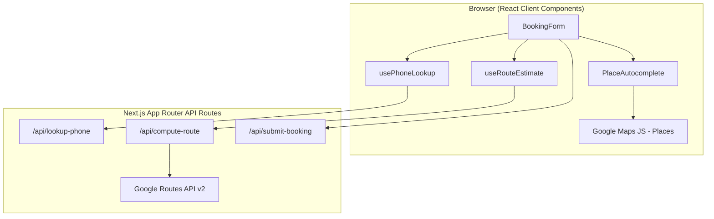

# Boundless Limousine Skills Test — Project Guide & Interview Prep

This document explains the **connect-next** booking form project in depth and provides **20 interview questions with prepared answers** aligned with the Full Stack Developer role (reservation & chauffeur management for airport transportation / limousine).

---

## Part 1 — Project Explanation

### 1.1 What this project is

This repository is a **skills-test implementation** of a customer booking form for chauffeured rides. It mirrors the layout from the employer’s reference design (ExampleIQ branding) and satisfies the mandatory test requirements:

| Requirement | How it’s met |
|-------------|--------------|
| Match layout | Sectioned form: trip type, pickup (date/time + location/airport), optional stops, drop-off, route summary, contact, passengers, submit |
| Responsive | Tailwind breakpoints (`sm:flex-row`, `sm:grid-cols-2`, `max-w-2xl` centered column) |
| Validate inputs | Client validation in `BookingForm` + Zod on all API routes |
| Google Maps distance + travel time | Places autocomplete (browser) + Routes API (server) |
| Phone lookup / greet or collect contact | Mock `/api/lookup-phone` with debounced lookup |
| Mock API submit | `/api/submit-booking` returns `BK-...` confirmation ID |

**Live demo:** [rene-Boundless-Limousine-app.vercel.app](https://rene-Boundless-Limousine-app.vercel.app)

---

### 1.2 High-level architecture



**Pattern:** Single-page booking UI with **thin API routes** that validate with Zod and delegate to `lib/booking/*` modules. Google credentials are split: **public browser key** for Places, **secret server key** for Routes.

---

### 1.3 Tech stack and why each choice was used

| Technology | Role | Why used |
|------------|------|----------|
| **Next.js 16 (App Router)** | Framework + API routes + deployment | One repo for UI and backend; Route Handlers replace a separate Express server; Vercel deploy is zero-config |
| **React 19** | UI | Standard for Next.js; client components where hooks/browser APIs are needed |
| **TypeScript** | Types across client/server | Shared `PlaceValue`, trip types, and Zod-inferred API payloads reduce bugs |
| **Tailwind CSS v4** | Styling | Fast layout matching the mock; design tokens in `globals.css` (`--brand`, `--logo`) |
| **Zod v4** | Validation | Single source of truth: same schemas on API routes; `ContactSchema` reused on client |
| **Google Maps Platform** | Locations + routing | Industry standard for limo/airport work; Places (New) for autocomplete; Routes API for drive distance/duration |
| **Lucide React** | Icons | Lightweight, consistent icons without a heavy UI kit |
| **pnpm** | Package manager | Fast installs; lockfile committed for reproducible builds |

No ORM or database in the test — intentional scope control. Production would add PostgreSQL (or similar), auth, and Stripe as described in the job posting.

---

### 1.4 Folder structure (detailed)

```
connect-next/
├── app/
│   ├── layout.tsx          # Root layout, fonts, global styles
│   ├── page.tsx            # Home page → renders BookingForm only
│   ├── globals.css         # Tailwind + CSS variables (brand colors)
│   └── api/
│       ├── lookup-phone/route.ts   # POST → mock customer DB
│       ├── compute-route/route.ts  # POST → Google Routes
│       └── submit-booking/route.ts # POST → mock booking persistence
├── components/
│   ├── BookingForm.tsx     # Main form state, validation, submit
│   ├── PlaceAutocomplete.tsx  # Google Places suggestions dropdown
│   ├── Field.tsx           # Outlined field shell (Material-like)
│   ├── Toggle.tsx          # One-way / Hourly and Location / Airport
│   └── UsFlag.tsx          # Phone field prefix icon
└── lib/
    ├── api/
    │   └── validated-post.ts    # Generic POST + Zod + error JSON
    ├── booking/
    │   ├── schemas.ts           # All Zod schemas
    │   ├── types.ts             # PlaceValue, TripType, PlaceKind
    │   ├── lookup-phone.ts      # Mock KNOWN_PHONES map
    │   ├── compute-route.ts     # Google Routes API client
    │   ├── submit-booking.ts    # Mock delay + confirmation ID
    │   ├── use-phone-lookup.ts  # Debounced client hook
    │   └── use-route-estimate.ts
    ├── google-maps.ts      # Script loader + singleton promise
    └── open-picker.ts      # Opens native date/time picker via icon click
```

**Design principle:** Routes stay **one line** (`createValidatedPostHandler(Schema, handler)`). Business logic lives in `lib/booking` so it can move to a real DB or microservice later without rewriting the UI.

---

### 1.5 Key features — implementation and rationale

#### Trip type and place kind toggles

- **One-way vs Hourly** and **Location vs Airport** use a reusable `Toggle` component.
- Airport mode passes `includedPrimaryTypes: ["airport"]` to Places autocomplete — filters suggestions for airport transfers (core limo use case).

#### Pickup, stops, drop-off

- Each place stores `{ placeId, address }` — **placeId** is required for Routes API; display address is for the user and mock submit payload.
- **Optional stops** are dynamic array state; only filled stops are sent on submit.
- Route estimate runs when **pickup and drop** both have placeIds (stops not included in route calc in this version — reasonable MVP; production would use multi-waypoint routing).

#### Date and time

- Native `<input type="date">` and `<input type="time">` for accessibility and mobile keyboards.
- Custom left icons call `openPicker()` because native picker affordances are inconsistent across browsers; Firefox keeps its native time control visible (documented in README).

#### Google Maps — two keys, two APIs

1. **Client (`NEXT_PUBLIC_GOOGLE_MAPS_BROWSER_KEY`)**  
   - Loads Maps JS with `loading=async`.  
   - `PlaceAutocomplete` uses **Places API (New)** via `AutocompleteSuggestion.fetchAutocompleteSuggestions` and **session tokens** (billing best practice: session groups autocomplete + eventual place details).

2. **Server (`GOOGLE_MAPS_API_KEY`)**  
   - `compute-route.ts` calls **Routes API v2** `computeRoutes` with `travelMode: DRIVE` and `routingPreference: TRAFFIC_AWARE`.  
   - Key never exposed to browser — prevents quota theft and follows Google’s security guidance.

**Why server-side routing:** Driving distance/duration must not be computed only on the client; server control allows caching, rate limiting, and consistent pricing logic later.

#### Phone lookup flow

1. User types phone; non-digits stripped except `+`.
2. After **8+ digits**, `usePhoneLookup` debounces **400ms** then POSTs to `/api/lookup-phone`.
3. **Known** → greeting `"Welcome back, {firstName}!"`, fields prefilled, contact section collapsed to summary.
4. **Unknown** → default greeting `"Let's get you on your way!"` plus first name, last name, email fields with `ContactSchema` validation.
5. Mock numbers: `+17744153244` (Jordan), `+15551234567` (John).

**Why debounce:** Avoids hammering the API on every keystroke; mirrors production CRM lookup patterns.

#### Validation strategy

- **Client (BookingForm):** Required fields, phone length, passenger range 1–50, conditional contact validation when phone unknown.
- **Server (Zod):** All three POST endpoints validate body shape and lengths before handlers run.
- **Defense in depth:** Even if someone bypasses the UI, malformed bookings are rejected with `400` and flattened Zod errors.

#### Submit flow

- POST `/api/submit-booking` with full payload; server validates with `BookingSchema`.
- Mock handler waits 400ms, returns `confirmationId: BK-{base36 timestamp}`.
- UI shows green confirmation banner.

---

### 1.6 Deployment and environment

- **Vercel** for CI/CD from Git push.
- Env vars documented in README: browser key (HTTP referrer restricted), server key (Routes API only, marked sensitive on Vercel).
- **No secrets in repo** — `.env.local` for local dev.

---

### 1.7 How this maps to the full job (beyond the test)

The job description describes a **multi-phase product**:

| Job scope | This test demonstrates |
|-----------|-------------------------|
| Customer booking portal | Booking form, quotes via distance/time |
| Admin/dispatch dashboard | Not built — but API module split supports adding admin apps |
| Chauffeur mobile app | Not built — same booking APIs could serve React Native |
| Stripe | Not built — submit endpoint is the integration point |
| Google Maps tracking | Distance/routing only; live tracking would use Maps SDK + websockets |
| Auth / DB / deployment | Patterns shown: validated APIs, env-based secrets, Vercel deploy |

**Talking point for application note:** Describe any real booking/logistics work (dispatch, fleet, CRM phone match, pricing by zone/mile) and explain how you’d extend this mock into PostgreSQL + Stripe + role-based admin.

---

## Part 2 — Top 20 Interview Questions & Prepared Answers

### Architecture & stack

**Q1. Walk me through this booking form project from browser to database.**

**Answer:** The user interacts with a client-side `BookingForm` in Next.js. Place search uses the Google Maps JavaScript Places library in the browser with a restricted public API key. When pickup and drop-off are selected, the client calls our `/api/compute-route` route, which uses a secret server key to call Google’s Routes API and returns miles and driving time. Phone entry triggers a debounced call to `/api/lookup-phone`, which today uses a mock in-memory map but would be a CRM or customers table in production. On submit, the client POSTs to `/api/submit-booking`; Zod validates the body server-side, and the mock handler returns a confirmation ID. In production I’d persist to PostgreSQL, enqueue dispatch notifications, and integrate Stripe for deposits or full payment.

---

**Q2. Why Next.js App Router instead of a separate React SPA + Express API?**

**Answer:** For a booking portal, colocating UI and Route Handlers reduces deployment complexity and keeps types and validation schemas in one monorepo. App Router gives server components for static shells and client components only where needed (forms, Maps). For a long-term limo platform, we can still extract services later—but for phase one, Next on Vercel is fast to ship and easy to secure API keys on the server.

---

**Q3. Why did you split Google Maps into two API keys?**

**Answer:** The browser key must be public for Places autocomplete, so it’s restricted by HTTP referrer and limited to Maps JS + Places APIs. Distance and routing for pricing should run server-side with a separate key restricted to Routes API only, kept off the client to prevent abuse and to centralize rate limiting and caching. That’s aligned with Google’s security recommendations and how I’d implement quote engines in production.

---

### Google Maps & logistics

**Q4. How do you calculate distance and travel time?**

**Answer:** After the user selects origin and destination from Places, we send `placeId` values to Google Routes API v2 `computeRoutes` with `travelMode: DRIVE` and `routingPreference: TRAFFIC_AWARE`. We parse `distanceMeters` and duration, convert to miles for US limo conventions, and format duration for display. Stops aren’t in the current route call—that’s a natural v2 improvement using intermediate waypoints.

---

**Q5. What’s the difference between Places Autocomplete (legacy) and what you used?**

**Answer:** This project uses the newer Places API flow: `importLibrary('places')` and `AutocompleteSuggestion.fetchAutocompleteSuggestions` with session tokens. Session tokens group autocomplete requests for billing and tie into place detail fetches. For airports, we filter with `includedPrimaryTypes: ['airport']` when the user toggles Airport mode.

---

**Q6. How would you add live chauffeur tracking?**

**Answer:** Drivers would publish GPS on an interval via a mobile app (React Native) to a backend channel—WebSocket, SSE, or Firebase. Dispatch and customer views would subscribe to trip-scoped updates and render markers on Google Maps or Mapbox. I’d separate tracking from quote routing: Routes API for estimates, real-time positions from our own telemetry with map-matching optional for ETA refinement.

---

### Validation, APIs & security

**Q7. How is input validation handled?**

**Answer:** Three layers: immediate UX checks in the form (required pickup/drop, phone length, passengers 1–50), Zod `ContactSchema` for unknown customers’ name/email, and server-side Zod on every POST route via a shared `createValidatedPostHandler`. That way client validation improves UX but never replaces server validation.

---

**Q8. Explain your `createValidatedPostHandler` pattern.**

**Answer:** It’s a small factory that parses JSON, runs `safeParse` on a Zod schema, returns 400 with flattened errors on failure, runs the business handler on success, and catches unexpected errors as 500. New endpoints only need a schema and a function—consistent error shape for the frontend and easy testing of handlers in isolation.

---

**Q9. How would you secure this for production?**

**Answer:** Add authentication (session or JWT) for admin; rate-limit public quote and lookup endpoints; CSRF protection if using cookies; sanitize and log PII carefully; store secrets only in env; use HTTPS everywhere; restrict Google keys; add CAPTCHA on anonymous booking if abused; validate phone via SMS OTP for high-value trips. Never trust client-side-only validation for pricing or payment.

---

### Phone / customer identity

**Q10. How does the phone lookup flow work and how would you scale it?**

**Answer:** When the normalized phone has at least eight digits, we debounce 400ms and POST to lookup-phone. Known customers get a personalized greeting and prefilled contact; unknown users see extra fields. In production I’d index E.164 numbers in the database, handle international formats with libphonenumber, and cache recent lookups client-side. For privacy, only return fields needed for greeting unless the user is authenticated.

---

**Q11. Why debounce phone lookup instead of lookup on blur?**

**Answer:** Debounce gives a balance: responsive enough for returning customers without a request per keystroke. Blur-only feels slower for UX; per-keystroke without debounce wastes API and DB calls. Four hundred milliseconds is a common sweet spot; I’d tune with metrics.

---

### Frontend & UX

**Q12. How did you make the form responsive and match the design?**

**Answer:** A centered `max-w-2xl` column, flexible grids that stack on mobile (`flex-col` → `sm:flex-row`), and outlined fields with floating-style labels via `Field` / `OutlinedFieldShell`. Brand colors live in CSS variables for consistent gold/purple theming. I tested Chrome, Edge, Firefox, and Safari including mobile, with special handling for date/time picker quirks.

---

**Q13. Why native date/time inputs instead of a custom date picker library?**

**Answer:** Native inputs give accessible, localized pickers on mobile with no extra bundle size. The design spec used simple fields; we enhanced UX with icon buttons that call `showPicker()` where supported. A library like react-day-picker is worth it for blackout dates or fleet availability—I'd add that when business rules require it.

---

**Q14. How do you manage loading and error states?**

**Answer:** Phone lookup shows “Checking…”; route area shows miles/time or a destructive error message; submit disables the button and shows “Submitting…”; confirmation or submit error banners are separate. Route fetch uses a cancelled flag in `useEffect` cleanup to avoid race conditions when pickup/drop change quickly.

---

### Data model & booking domain (job-aligned)

**Q15. How would you model reservations in a database for a limo company?**

**Answer:** Core tables: `customers` (phone E.164 unique), `bookings` (status, trip_type, scheduled_at, passenger_count), `booking_stops` (sequence, address, place_id, type pickup/stop/dropoff), `quotes` (distance, duration, price_breakdown), `vehicles`, `drivers`, `assignments`. Status workflow: draft → quoted → confirmed → assigned → en route → completed → cancelled. Index on `scheduled_at` and `status` for dispatch boards. Soft-delete and audit log for disputes.

---

**Q16. How would you price a trip from this form’s data?**

**Answer:** Base fee + per-mile or zone matrix + airport surcharge + hourly minimum for hourly trips + peak/time-of-day multipliers + tolls/parking pass-through. Use Routes API distance/time as inputs, apply fleet rules server-side, return breakdown to UI before payment. Stripe PaymentIntent amount must match server-computed quote, not client-posted numbers.

---

**Q17. Experience integrating Stripe for bookings?**

**Answer:** (Tailor to your experience.) Typical flow: create Customer on first booking, create PaymentIntent or Checkout Session server-side from the quoted amount, webhooks for `payment_intent.succeeded` to confirm booking, idempotency keys on retry, handle failures with booking status `payment_pending`. For corporate accounts, invoice or saved payment methods. Never expose secret keys; use Connect if paying drivers/platform splits.

---

### Mobile, dispatch & scale

**Q18. How would you build the chauffeur mobile app mentioned in the job?**

**Answer:** React Native fits well if the team is React-heavy—shared TypeScript types with the web API. Core features: auth, assigned trips list, navigation deep link to Google/Apple Maps, status updates (arrived, passenger onboard, completed), background location with permission UX, push notifications via FCM/APNs. Offline queue for status pings. API would be the same booking service with driver role guards.

---

**Q19. What would an admin/dispatch dashboard need?**

**Answer:** Real-time trip board (filters by date, status, airport), drag-and-drop or auto-assign drivers by vehicle class and proximity, customer contact click-to-call, map view of fleet, override pricing, cancellation/no-show handling, and reporting. WebSockets for live updates; RBAC for dispatchers vs admins. Built as a separate Next app or module sharing the same API.

---

### Process, testing & ownership

**Q20. How did you approach this skills test without overbuilding?**

**Answer:** I matched the spec first: layout, validation, Maps, phone behavior, mock submit. I kept a clean module boundary (`lib/booking`) so the mocks swap for real services. I documented env setup and demo phones in the README, deployed to Vercel, and focused on security basics (split Maps keys, server validation). For a long-term limo platform I’d iterate in phases: booking + quotes → payments → dispatch → driver app → tracking—same architecture, adding DB and auth at each gate.

---

## Part 3 — Quick reference for your application email

**Suggested one-liner for “brief note on booking/logistics experience”:**

> I built this skills test as a Next.js booking flow with Google Places/Routes, server-validated APIs, and returning-customer phone lookup. [Add 2–3 sentences on any real dispatch, fleet, CRM, or e-commerce booking work you've done and how it transfers to chauffeur/reservation systems.]

**Demo phones for screen recording:**

- `+17744153244` → “Welcome back, Jordan!”
- `+15551234567` → “Welcome back, John!”
- Any other number → contact fields appear

**Repo checklist before sending:**

- [ ] GitHub repo public with README
- [ ] `.env.example` present (no real keys committed)
- [ ] 2–3 min video: form demo + brief code walkthrough
- [ ] Resume + portfolio link
- [ ] This guide (optional — for your own prep; do not required to submit)

---

*Generated for interview preparation for the Boundless Limousine / airport transportation full-stack role.*
